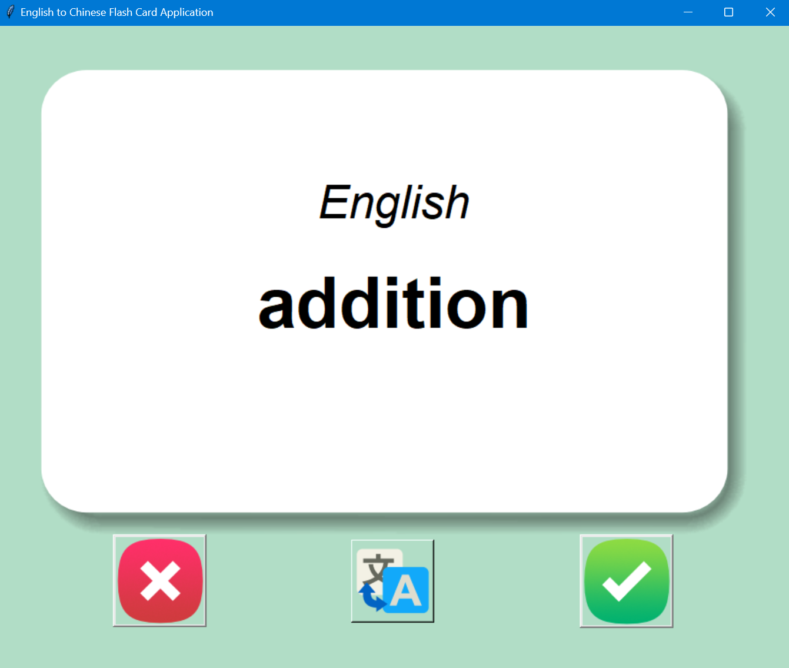
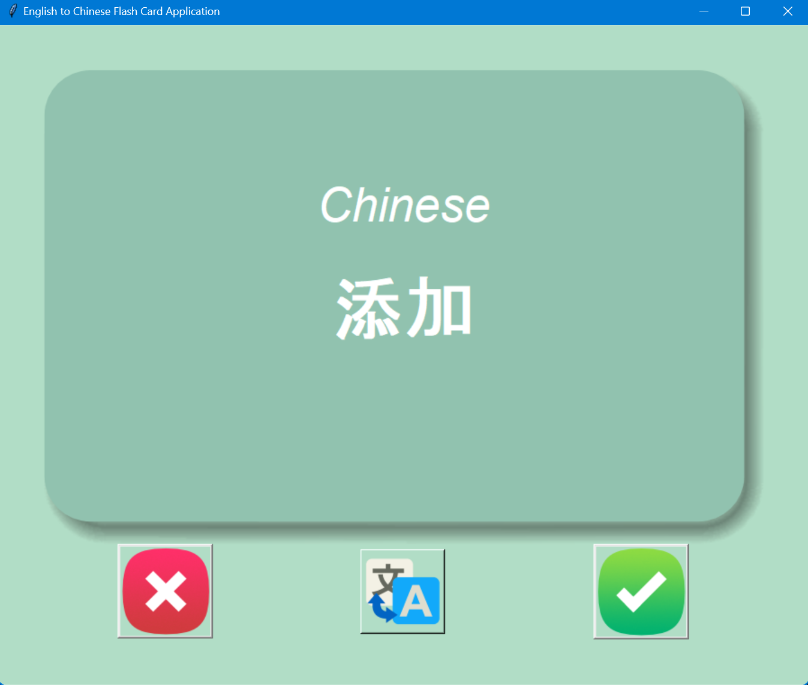

# English-Chinese-Learning-Tool
A English and Chinese translation tool to help user to memorise English and Chinese vocabulary, there are total 3000 words in the database for user to learn, 
those words are picked randomly. If users already memorised the particular word, they can press the "memorised" button, then the word will be excluded from 
the database, so the word won't be displayed again.  *PS: THE TRANSLATION IS POWERED BY GOOGLE TRANSLATE

 

### How to run the program.
#### 1. Clone the project or download it to your local machine.
#### 2. Run the `main.py`, ensure you have `pyperclip` module installed.
#### 3. That's it! Enjoy the program!

 

### User Manual
#### 1. This is what you see when you run the program.

#### 2. Press this translate button when you wanna see the translation.

#### 3. Then you can see the Chinese translation.

#### 4. If you already memorised this word, press this button, then this word will be removed from the database, it won't appear again next time you run the program.

#### 5. If you still can't remember it currently, it's ok, press this button so it will appear again next time.

#### 6. Once you finished all 3000 words in the database, and all buttons will be disabled.

